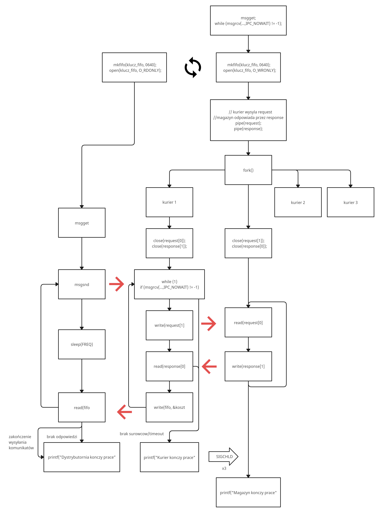

# Magazyny
Projekt stworzony w języku C, wykorzystujący działanie procesów w systemie Linux: kolejki fifo, pipe, kolejka komunikatów, sygnały, fork.

Projekt ma symulować działanie dyspozytorni zamówień oraz trzech firm magazynowych. 

## Schemat projektu
